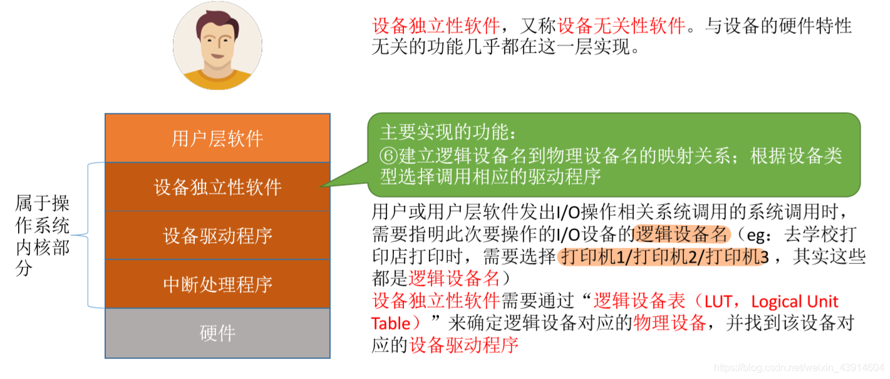
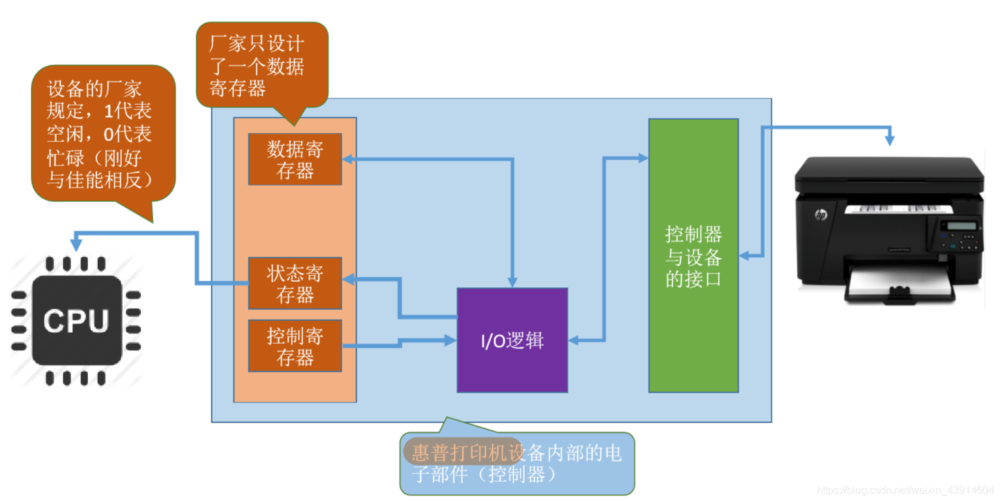
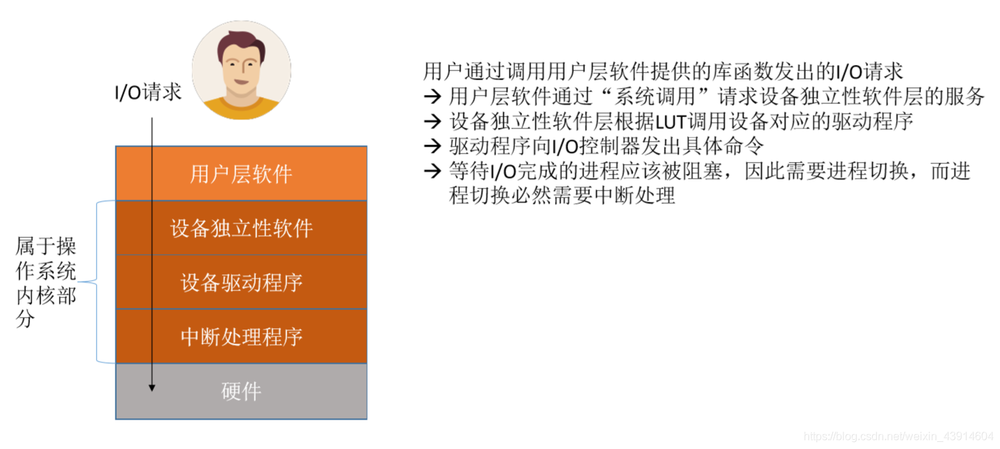

# (201条消息) 5.1.4 OS之I/O软件的层次结构（用户层软件-设备独立性软件-设备驱动程序-中断处理程序-总结回顾）_BitHachi的博客-CSDN博客

### 文章目录

*   [0.I/O软件层次总览](#0IO_2)
*   [1.用户层软件](#1_4)
*   [2.设备独立性软件](#2_7)
*   *   [六大功能](#_9)
    *   [逻辑设备表---LUT](#LUT_13)
    *   [为什么不同的设备需要不同的驱动程序呢？](#_15)
*   [3.设备驱动程序](#3_22)
*   [4.中断处理程序](#4_24)
*   [5.总结回顾](#5_27)

* * *

# 0.I/O软件层次总览

# 1.用户层软件

# 2.设备独立性软件

## 六大功能

  
  

## 逻辑设备表—LUT

## 为什么不同的设备需要不同的驱动程序呢？

  
**举几个假设的例子：**

  
  

# 3.设备驱动程序

# 4.[中断](https://so.csdn.net/so/search?q=%E4%B8%AD%E6%96%AD&spm=1001.2101.3001.7020)处理程序

  

# 5.总结回顾

参考：《王道操作系统》