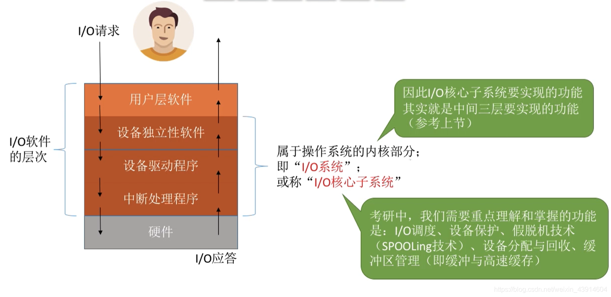
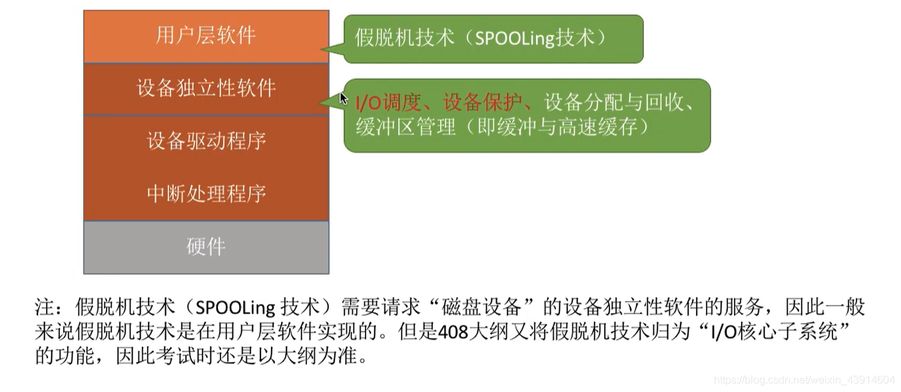
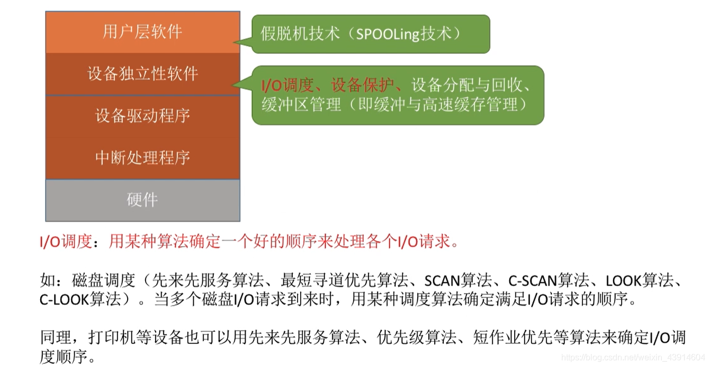

# (201条消息) 5.2.1 OS内核的I/O核心子系统及功能_BitHachi的博客-CSDN博客

### 文章目录

*   [0.I/O核心子系统以及功能](#0IO_3)
*   [1.这些功能在哪个层次实现？](#1_6)
*   *   [假脱机技术](#_7)
    *   [I/O调度](#IO_9)
    *   [设备保护](#_11)

* * *

# 0.I/O核心子系统以及功能

# 1.这些功能在哪个层次实现？

## 假[脱机](https://so.csdn.net/so/search?q=%E8%84%B1%E6%9C%BA&spm=1001.2101.3001.7020)技术

## I/O调度

## 设备保护

