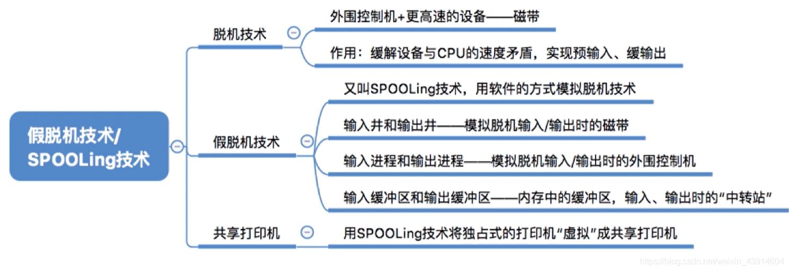
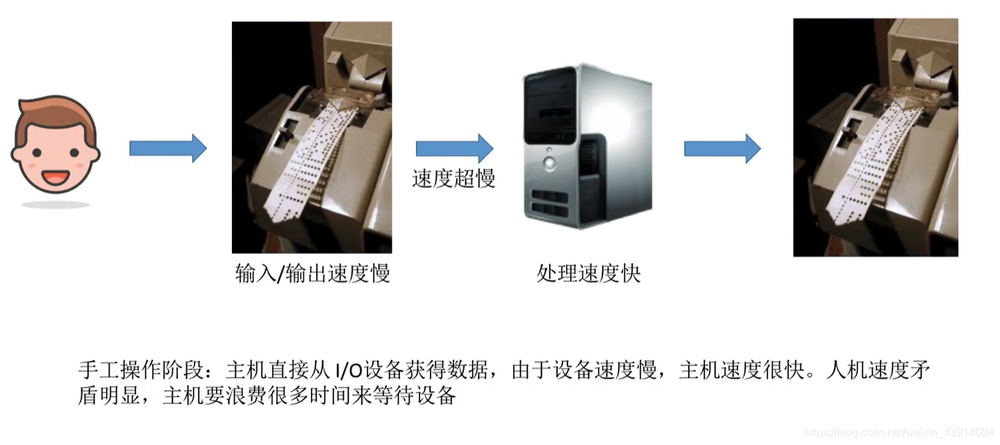
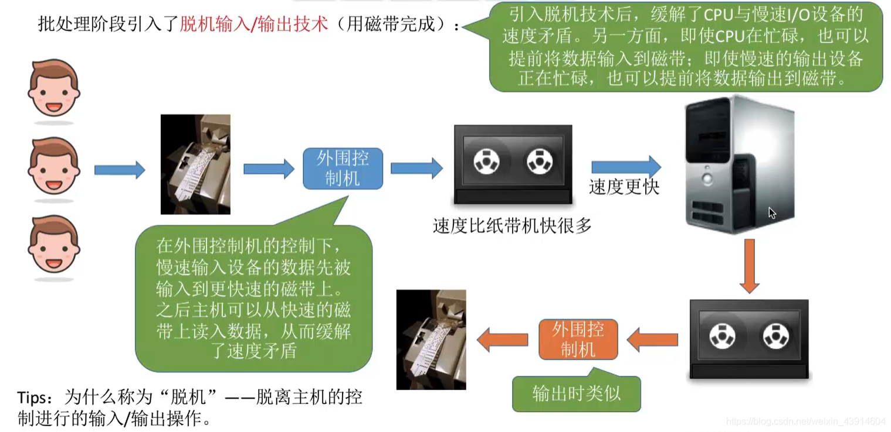
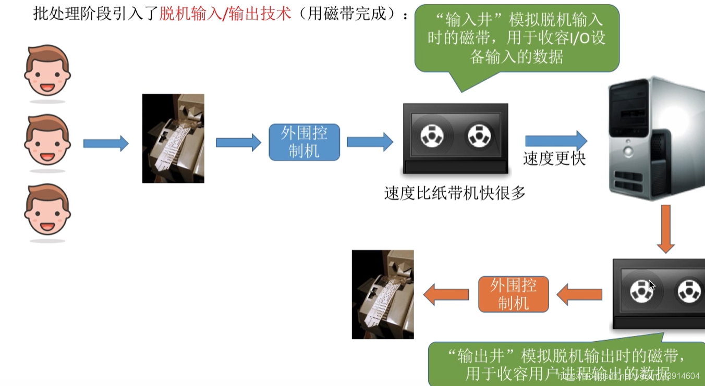
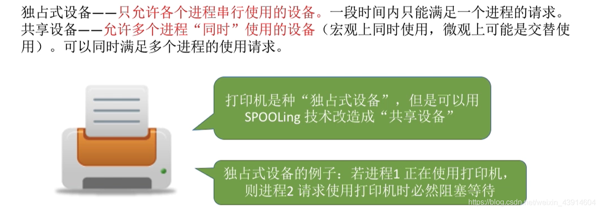
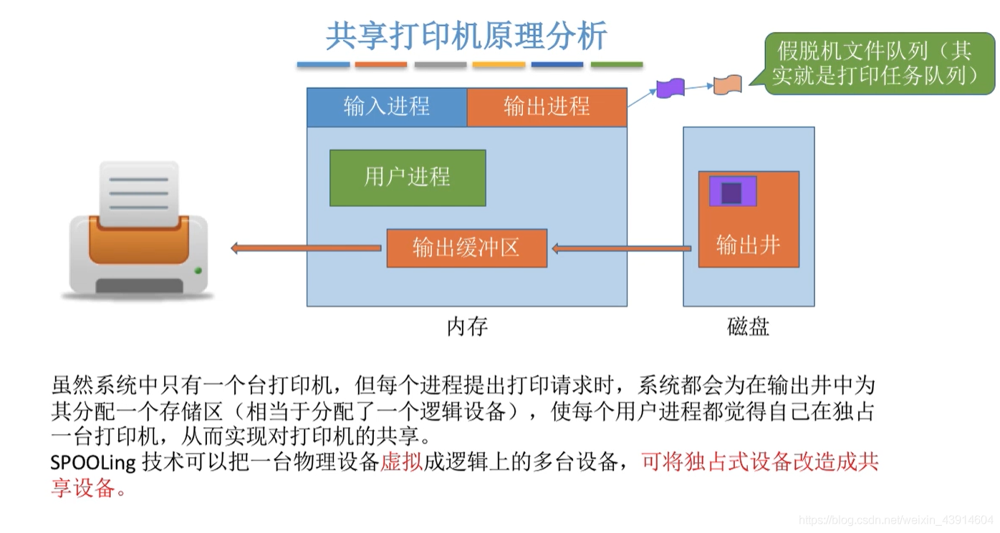

# (201条消息) 5.2.2 OS之I/O设备假脱机技术(SPOOLing)_BitHachi的博客-CSDN博客

### 文章目录

*   [0.思维导图](#0_2)
*   [1.什么是脱机技术？](#1_4)
*   [2.假脱机技术](#2_10)
*   *   [输入井和输出井](#_13)
    *   [输入进程与输出进程](#_17)
    *   [输入输出缓冲区](#_20)
    *   [共享打印机原理分析---假脱机技术的一种应用](#_22)

* * *

# 0.思维导图

# 1.什么是[脱机](https://so.csdn.net/so/search?q=%E8%84%B1%E6%9C%BA&spm=1001.2101.3001.7020)技术？

**这里温习一下手工操作阶段：**  

*   因为手工阶段的速度慢问题，引入了脱机技术  
    

# 2.假脱机技术

*   在脱机技术的基础上人们发明了更好的假脱机技术

## 输入井和输出井

  

## 输入进程与输出进程

  

## 输入输出缓冲区

## 共享打印机原理分析—假脱机技术的一种应用

**先了解一下独占和共享设备，以此引出假脱机技术如何实现对独占设备的共享：**  
  

*   打印请求完成后，请求表从打印队列删除，执行后续队列的打印任务

参考：《王道操作系统》