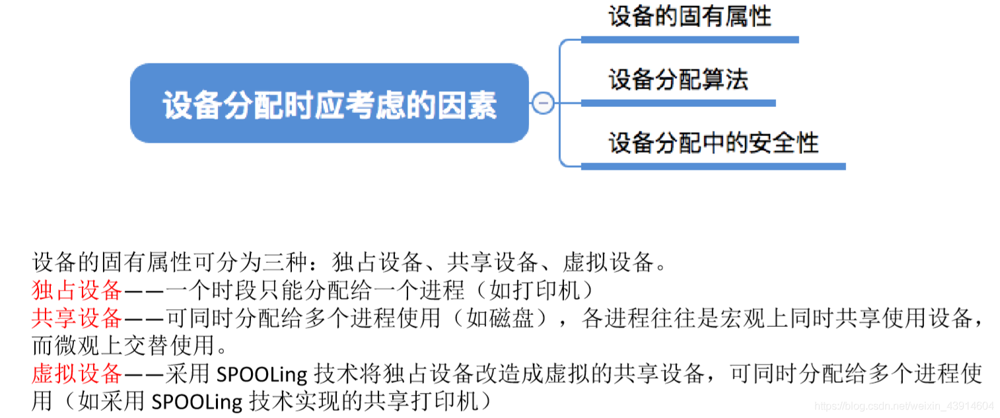
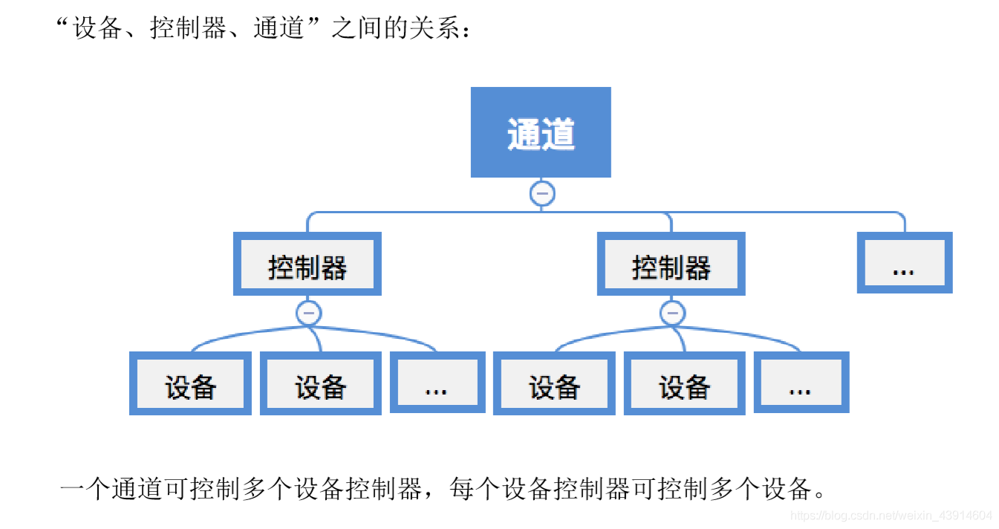
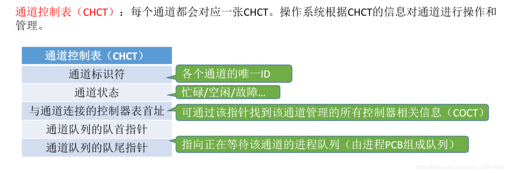
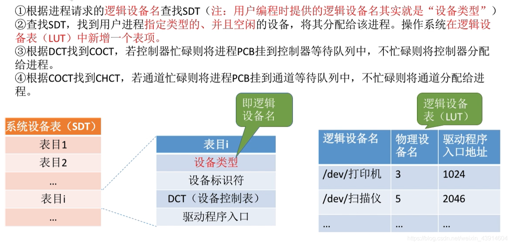

# (201条消息) 5.2.3 OS之I/O设备的分配与回收（DCT-COCT-CHCT-SDT）_BitHachi的博客-CSDN博客_dct chct

### 文章目录

*   [0.思维导图](#0_3)
*   [1.设备分配时应该考虑的因素](#1_7)
*   *   [设备的固有属性](#_8)
    *   [设备的分配算法](#_10)
    *   [设备分配中的安全性](#_13)
*   [2.静态分配与动态分配](#2_16)
*   [3.设备分配管理中的数据结构](#3_18)
*   *   [设备控制表---DCT](#DCT_22)
    *   [控制器控制表---COCT](#COCT_25)
    *   [通道控制表---CHCT](#CHCT_27)
    *   [系统设备表---SDT](#SDT_29)
*   [4.设备分配的步骤](#4_33)
*   *   [设备分配的改进步骤](#_38)

* * *

# 0.思维导图

# 1.设备分配时应该考虑的因素

## 设备的固有属性

## 设备的分配算法

## 设备分配中的安全性

# 2.静态分配与动态分配

# 3.设备分配管理中的[数据结构](https://so.csdn.net/so/search?q=%E6%95%B0%E6%8D%AE%E7%BB%93%E6%9E%84&spm=1001.2101.3001.7020)

**设备、控制器、通道之间的关系：**  

## 设备控制表—DCT

## 控制器控制表—COCT

## [通道](https://so.csdn.net/so/search?q=%E9%80%9A%E9%81%93&spm=1001.2101.3001.7020)控制表—CHCT

## 系统设备表—SDT

# 4.设备分配的步骤

  
  
  

## 设备分配的改进步骤

  
  
  
参考：《王道操作系统》