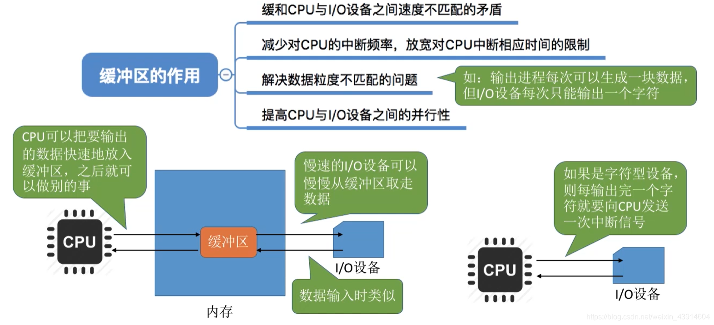
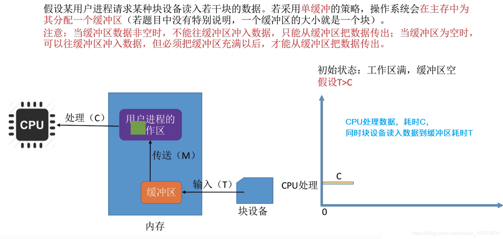
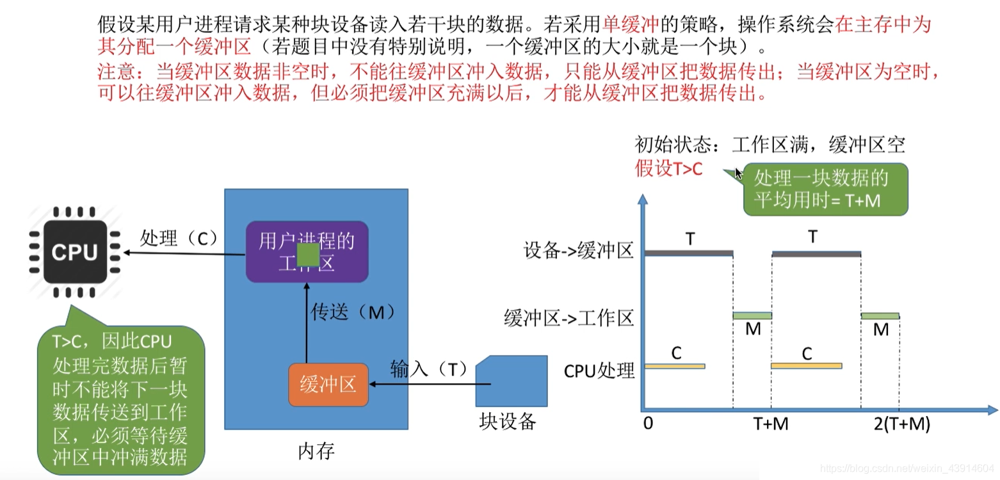
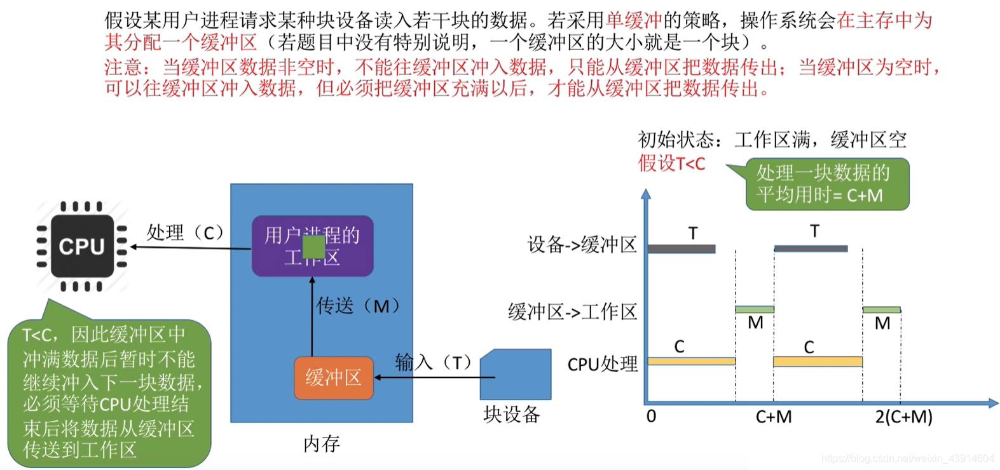
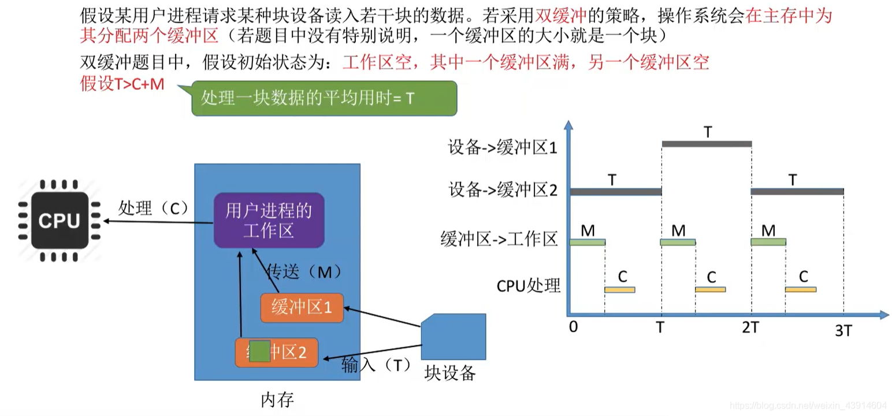
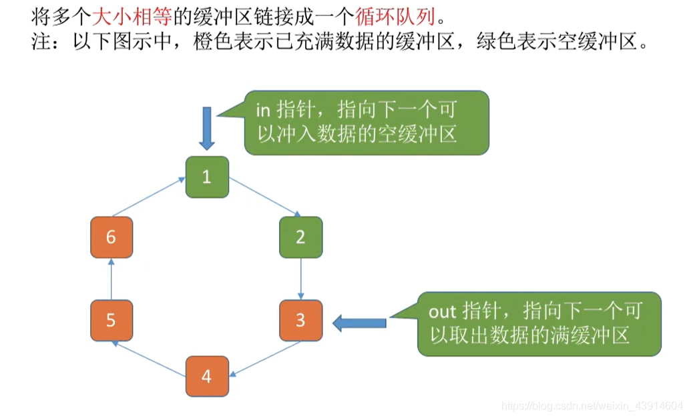
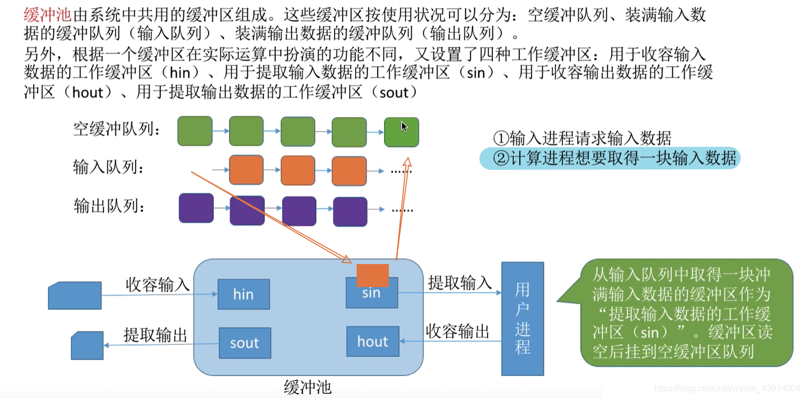

# (201条消息) 5.2.4 OS之缓冲区管理（单缓冲-双缓冲-循环缓冲-缓冲池）_BitHachi的博客-CSDN博客

### 文章目录

*   [0.思维导图](#0_1)
*   [1.什么是缓冲区？有什么作用？](#1_3)
*   [2.单缓冲](#2_6)
*   [3.双缓冲](#3_17)
*   [4.单缓冲和双缓冲通信时的区别](#4_24)
*   [5.循环缓冲区](#5_27)
*   [6.缓冲池](#6_29)

# 0.思维导图

# 1.什么是缓冲区？有什么作用？

  

# 2.单缓冲

  
**T>C时的例子：**

  
  
  
**T<C时：**

# 3.双缓冲

**T>C+M时：**

  
**T<C+M时：**  
  

# 4.单缓冲和双缓冲通信时的区别

  

# 5.循环缓冲区

# 6.缓冲池

  
  
  
  
  
参考：《王道操作系统》