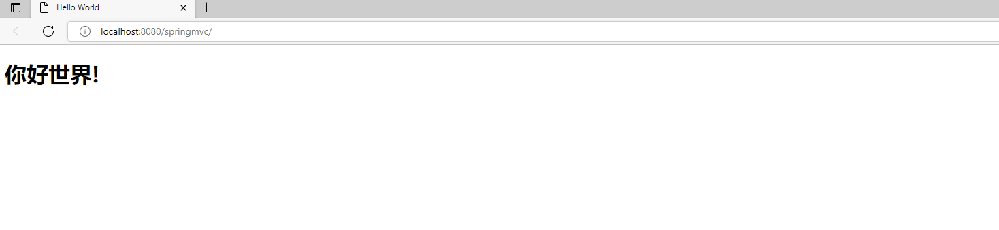
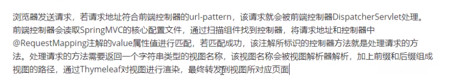
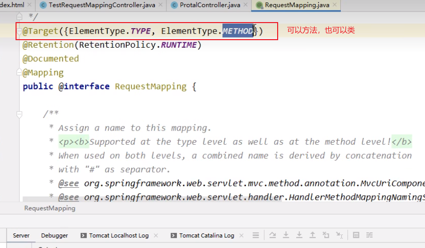
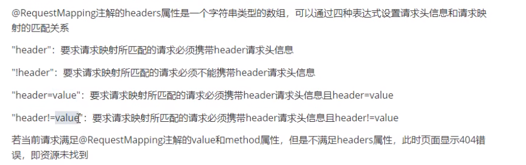
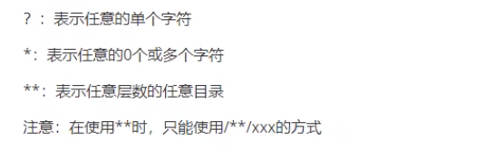
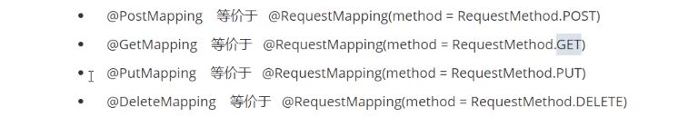

---

* [https://www.wolai.com/qb7t8rAz5nynF51RQ8ptex - 我来 wolai - 不仅仅是未来的云端协作平台与个人笔记](https://www.wolai.com/qb7t8rAz5nynF51RQ8ptex)
* 用 “我来” 搭建一站式协作平台，团队知识库、仪表台、工作流、内部应用、外部网站与个人云端笔记、待办……开箱即用！
* 2022-10-25 23:11:34

---

SpringMVC 5.3.1 + thymeleaf 3.0.12

SpringMVC 是 Spring 的一个后续产品，是Spring的一个子项目，是View层一整套完备解决方案。

**1**

Spring 家族原生产品，与IOC容器无缝对接。

**2**

基于原生Servlet，通过了功能强大的前端控制器DispatcherServlet来进行请求的统一管理。

**3**

内部组件化程度高、可插拔式组件即插即用，想要什么功能配置相应组件即可。

IDEA : 2022.1 构建工具：Maven 3.8.6 服务器：tomcat 8.5 Spring 版本 5.3.1

<?xml version="1.0" encoding="UTF-8"?> <project xmlns="http://maven.apache.org/POM/4.0.0"          xmlns:xsi="http://www.w3.org/2001/XMLSchema-instance"          xsi:schemaLocation="http://maven.apache.org/POM/4.0.0 http://maven.apache.org/xsd/maven-4.0.0.xsd">     <modelVersion>4.0.0</modelVersion>      <groupId>com.atguigu.springmvc</groupId>     <artifactId>springmvc_mvc_helloworld</artifactId>     <version>1.0-SNAPSHOT</version>     <packaging>war</packaging>      <properties>         <maven.compiler.source>11</maven.compiler.source>         <maven.compiler.target>11</maven.compiler.target>     </properties>      <dependencies>          <!-- 依赖 SpringMVC 则就直接依赖了 Spring 的IOC-->         <dependency>             <groupId>org.springframework</groupId>             <artifactId>spring-webmvc</artifactId>             <version>5.3.1</version>         </dependency>          <!-- Servlet API -->         <dependency>             <groupId>javax.servlet</groupId>             <artifactId>javax.servlet-api</artifactId>             <version>3.1.0</version>             <scope>provided</scope>         </dependency>          <!-- Spring5 和 Thymeleaf 整合包 -->         <dependency>             <groupId>org.thymeleaf</groupId>             <artifactId>thymeleaf-spring5</artifactId>             <version>3.0.12.RELEASE</version>         </dependency>          <!-- logback 日志: thymeleaf 整合包里面包含了 slf4j 的门面, 因此需要此实现 -->         <dependency>             <groupId>ch.qos.logback</groupId>             <artifactId>logback-classic</artifactId>             <version>1.2.3</version>         </dependency>     </dependencies>  </project>

主要目的是注册 DispatcherServlet → 其会完成 IOC容器的创建和管理.

<?xml version="1.0" encoding="UTF-8"?> <web-app xmlns="http://xmlns.jcp.org/xml/ns/javaee"          xmlns:xsi="http://www.w3.org/2001/XMLSchema-instance"          xsi:schemaLocation="http://xmlns.jcp.org/xml/ns/javaee http://xmlns.jcp.org/xml/ns/javaee/web-app_4_0.xsd"          version="4.0">      <!-- 配置SpringMVC的前端控制器 DispatcherServlet -->     <servlet>         <servlet-name>dispatcherServlet</servlet-name>  <!-- 名称可以随便写 -->         <servlet-class>org.springframework.web.servlet.DispatcherServlet</servlet-class>          <!--        <init-param>--> <!--            <param-name>ContextConfigLocation</param-name>--> <!--            <param-value>classpath:springmvc-config.xml</param-value>--> <!--        </init-param>-->          <load-on-startup>1</load-on-startup>     </servlet>     <servlet-mapping>         <servlet-name>dispatcherServlet</servlet-name>         <!--             /  : 能匹配所有的请求，但是不能包括 .jsp 结尾的请求 会 交给 JSPServlet 进行处理.  （推荐使用）、且需 springmvc 开启静态资源处理, 才能访问静态资源             /* : 能匹配到所有的请求(包括)             *.do : 后缀匹配 ,                优点：1. 静态资源不会经过 springmvc， 不用额外开启静态资源配置 ;                     2. 可以实现伪静态的效果, 比如 *.html                        作用1: 给黑客入侵增加难度.                        作用2: 有利于SEO的优化(排名更靠前)               缺点：不符合 RESTful 风格               推荐方式:           -->         <url-pattern>/</url-pattern>     </servlet-mapping> </web-app>

默认固定名字：<servlet-name>-servlet.xml → dispatcherServlet-servlet.xml 默认固定位置：WEB-INF下  →   /WEB-INF/dispatcherServlet-servlet.xml  如果想修改SpringMVC配置文件的名称和路径，则看上方 web.xml 中被注释掉的初始化参数即可.

<?xml version="1.0" encoding="UTF-8" ?> <beans xmlns="http://www.springframework.org/schema/beans"        xmlns:xsi="http://www.w3.org/2001/XMLSchema-instance"        xmlns:util="http://www.springframework.org/schema/util"        xmlns:context="http://www.springframework.org/schema/context"        xsi:schemaLocation="http://www.springframework.org/schema/beans        http://www.springframework.org/schema/beans/spring-beans-4.0.xsd        http://www.springframework.org/schema/util        https://www.springframework.org/schema/util/spring-util.xsd        http://www.springframework.org/schema/context        http://www.springframework.org/schema/context/spring-context.xsd">      <!-- 包扫描 : 这里只管 controller，放置到MVC的容器里面-->     <context:component-scan base-package="com.atguigu.springmvc.controller"></context:component-scan>      <!-- 配置 Thymeleaf 视图解析器          配置完毕后可以使用MVC的方式完成视图渲染和跳转了     -->     <bean id="viewResolver" class="org.thymeleaf.spring5.view.ThymeleafViewResolver">         <property name="order" value="1"/>         <property name="characterEncoding" value="UTF-8"/>         <property name="templateEngine">             <bean class="org.thymeleaf.spring5.SpringTemplateEngine">                 <property name="templateResolver">                     <bean class="org.thymeleaf.spring5.templateresolver.SpringResourceTemplateResolver">                          <!-- 视图前缀 -->                         <property name="prefix" value="/WEB-INF/templates/"/>                          <!-- 视图后缀 -->                         <property name="suffix" value=".html"/>                          <property name="templateMode" value="HTML5"/>                         <property name="characterEncoding" value="UTF-8"/>                     </bean>                 </property>             </bean>         </property>     </bean>      <!-- 开启注解驱动       @ControllerAdvice      @ResponseBody      @RequestBody     -->     <mvc:annotation-driven />  </beans>

/WEB-INF/templates/index.html

<!DOCTYPE html> <html lang="en" xmlns:th="http://www.thymeleaf.org"> <head>     <meta charset="UTF-8">     <title>Title</title> </head> <body> <h1>Hello, Spring</h1> </body> </html>

package com.atguigu.springmvc.controller;  import org.springframework.stereotype.Controller; import org.springframework.web.bind.annotation.RequestMapping;  @Controller public class HelloController {      @RequestMapping("/")  // / 即 ..../ContextRoot/     public String portal() {         // 将逻辑视图返回         return "index";     } }

​

​

​

标记在类上 ：/test  标记在方法上 :  /hello  →  则请求为 .../ContextRoot/test/hello

放在类上的目的：一个Controller一个模块。

@AliasFor("path") String[] value() default {};  @AliasFor("value") String[] path() default {};

是个数组，表明其可以放置多个 path ，匹配当中任意一个均可。

@RequestMapping({"/hello", "abc"})  // / 即 ..../ContextRoot/ public String portal() {     // 将逻辑视图返回     return "index"; }

除了匹配到 Path 还要 请求方式相同，取值是个枚举量。

    @RequestMapping(value = {"/hello", "abc"}, method = RequestMethod.POST)      public String portal() {         // 将逻辑视图返回         return "index";     }

对参数进行限制，可以要求必须携带某些参数，或者是某些参数必须是某个值，或者是某些参数不是某个值

例如：我们期望让请求的资源路径为 /test/testParams 的 GET 请求，并且请求参数中 具有 code参数 能够被 testParams 方法处理，则可以写如下代码。

@RestController @RequestMapping("/test") public class TestController {      @RequestMapping(value = "/testParams", method = Request,GET, params = "code")   public String testParams() {     sout("test");     return "ok";   } }

例如：我们期望让请求的资源路径为 /test/testParams 的 GET 请求，并且请求参数中 不能具有 code参数 能够被 testParams 方法处理，则可以写如下代码。

@RequestMapping(value = "/testParams", method = Request,GET, params = "!code")

例如：我们期望让请求的资源路径为 /test/testParams 的 GET 请求，并且请求参数中 具有 code参数 ，且必须为某个值能够被 testParams 方法处理，则可以写如下代码。

@RequestMapping(value = "/testParams", method = Request,GET, params = "code=aaa")

​

@RequestMapping(value = "/testParams", method = Request,GET, headers = "!deviceType")

指定请求的 content-type 内容：比如如下代码指定 ContentType 必须为 multipart/form-data（即包含文件域）的请求才能接收处理。

@RequestMapping(value = "/testConsumes", method = Request.POST, consumes = "multipart/form-data")

比如如下代码指定 ContentType 不能为为 multipart/form-data（即包含文件域）的请求才能接收处理

@RequestMapping(value = "/testConsumes", method = Request.POST, consumes = "!multipart/form-data")

​

@RequestMappng("/a?a/test/ant")    // aba/test/ant 或 ava/test/ant 都能匹配到，但是 ? 本身无法匹配 @RequestMappng("/a*a/test/ant&quot;)    // aaaa/test/ant 能匹配到，但是不能使用 ? 和 / 替换* @RequestMappng("/**/test/ant")

参数也作为路径的一部分 原始方式：/user/deleteUser?id=1 Restful : /user/delete/1

@DeleteMapping("/delete/{username}/{id}")  // / 即 ..../ContextRoot/ public String delete(@PathVariable("username") String username, @PathVariable("id") Integer uid) {     // 将逻辑视图返回     return "index"; }

​

@RequestMapping("/paramServletAPI") public String getParamByServletAPI(HttpServletRequest request) {     String username = request.getParameter("username");     String password = request.getParameter("password");     return "success"; }

请求参数的name 和 形式参数名字相同即可。  当名字不一致的时候，使用 @RequestParam，其有三个属性 required,  defaultValue (当 required 为false的时候，且未获取到参数，则使用 defaultValue)

// http://localhost:8080/springmvc_demo/param/mvc?username=xiaoxuanzi1654&password=16540504 @RequestMapping("/mvc") public String getParam(String username, String password) {     return "success"; }   // http://localhost:8080/springmvc_demo/param/mvc?user=xiaoxuanzi1654&pwd=16540504 @RequestMapping("/mvc") public String getParam(@RequestParam(value = "user", required = true) String username,                        @RequestParam(value = "pwd", required = true) String password) {     return "success"; }

使用 @RequestHeader，其有三个属性 required,  defaultValue (当 required 为false的时候，且未获取到参数，则使用 defaultValue)

@RequestMapping("/mvc") public String getParam(@RequestHeader(value = "referer", required = false, defaultValue = "aaa") String referer) {     return "success"; }

使用 @CookieValue，其有三个属性 required,  defaultValue (当 required 为false的时候，且未获取到参数，则使用 defaultValue)

@RequestMapping("/mvc") public String getParam(@CookieValue(value = "JSESSIONID") String jsessionId) {     return "success"; }

 属性名 和 请求参数名字一致即可。 不管是 GET 或 POST 的x-www-urlencode 均可.

@Data public class User {     private Integer id;     private String username;     private String password; }

@RequestMapping("/pojo") public String getParamByPojo(User user) {     return "success"; }

GET/POST 均可，需要加上 @RequestParam注解

@RequestMapping(value = "/queryActivityByConditionForPage") public @ResponseBody PageInfo<Activity> queryActivityByConditionForPage(@RequestParam Map<String, Object> condition) {     if(null == condition.get("pageNo"))         condition.put("pageNo", 1);     if(null == condition.get("pageSize"))         condition.put("pageSize", 10);     return activityService.queryActivitiesByCondition(condition); }

解决请求参数获取时候的乱码问题 此过滤器一定要配置到最前面，要不然会无效，因为在设置编码之前一定不能设置请求参数。

<filter>     <filter-name>characterEncodingFilter</filter-name>     <filter-class>org.springframework.web.filter.CharacterEncodingFilter</filter-class>     <init-param>         <param-name>encoding</param-name>         <param-value>UTF-8</param-value>     </init-param>     <init-param>         <param-name>forceEncoding</param-name>         <param-value>true</param-value>     </init-param> </filter> <filter-mapping>     <filter-name>characterEncodingFilter</filter-name>     <url-pattern>/*</url-pattern> </filter-mapping>

6.1 ServletAPI → Request 域 （不推荐）

@RequestMapping("/pojo") public String getParamByPojo(User user, HttpServletRequest request) {     request.setAttribute();     return "success"; }

6.2 ModelAndView → Request（重点）

不管用什么方式设置域数据，最终在SpringMVC的底层都会被封装成一个ModelAndView，所以直接用ModelAndView即可。

@Controller @RequestMapping("/scope") public class TestScopeController {     @RequestMapping("/mav")     public ModelAndView testMAV() {         /**          * 包含 Model 和 View 的功能          * Model ： 向 Request 域中共享数据          * View : 设置逻辑视图，实现页面跳转          */         ModelAndView modelAndView = new ModelAndView();         modelAndView.addObject("testRequestScope", "Hello, ModelAndView");         modelAndView.setViewName("success");          // 设置逻辑视图         return modelAndView;     } }

就是Model单独拿出来，方法依然返回String即可。

@RequestMapping("/model") public String testModel(Model model) {      model.addAttribute("testRequestScope", "Hello Model");      // 设置逻辑视图     return "success"; }

// 转发 return "forward:/test/model";  // 重定向 return "redirect:/test/model"

如果Controller代码里面仅仅是完成页面跳转，则可以使用 视图控制器，就不用写Contrller的代码的了。  在SpringMVC的xml文件当中进行配置。   注意：页面里面的请求必须也是 视图控制器 配置，除非开启 mvc 注解驱动，否则请求都是 404

<!-- 配置视图控制器 --> <mvc:view-controller path="/" view-name="index"></mvc:view-controller>  <!-- 注解驱动开启 --> <mvc:annotation-driven/>

关于 RESTful 的概念可以看 RESTful

9.1 HiddenHttpMethodFilter

目前从浏览器能发送的请求只有GET 和 POST，所以需要添加 HiddenHttpMethodFilter让其支持 PUT 和 DELETE   注意点1：PUT/DELETE 的请求从浏览器发出的时候必须以POST方式发出，然后携带请求参数 _method = "PUT" 或 "DELETE"。   注意点2：如果配置了编码过滤器，记得将编码过滤器放到 处理请求方式的过滤器 的前面。

<!-- 处理请求方式的过滤器 --> <filter>     <filter-name>hiddenHttpMethodFilter</filter-name>     <filter-class>org.springframework.web.filter.HiddenHttpMethodFilter</filter-class> </filter> <filter-mapping>     <filter-name>hiddenHttpMethodFilter</filter-name>     <url-pattern>/*</url-pattern> </filter-mapping>

<!DOCTYPE html> <html lang="en" xmlns:th="http://www.thymeleaf.org"> <head>     <meta charset="UTF-8">     <title>Title</title> </head> <body>     <a th:href="@{/user}">查询所有的用户信息</a>            <a th:href="@{/user/1}">查询id为1的用户信息</a>            <form th:action="@{/user}" method="post">         <input type="submit" value="添加用户信息"/>     </form>      <form th:action="@{/user}" method="post">         <input type="hidden" name="_method" value="PUT"/>         <input type="submit" value="修改用户信息"/>     </form>      <form th:action="@{/user/1}" method="post">         <input type="hidden" name="_method" value="DELETE"/>         <input type="submit" value="删除用户"/>     </form> </body> </html>

package com.atguigu.springmvc.controller;  import org.springframework.stereotype.Controller; import org.springframework.web.bind.annotation.PathVariable; import org.springframework.web.bind.annotation.RequestMapping; import org.springframework.web.bind.annotation.RequestMethod;  /**  * 用户资源 user  * 查询所有的用户信息 ---> /user      :GET  * 根据id查询所有的用户 ---> /user/id :GET  * 添加用户信息 ---> /user           :POST  * 修改用户信息 ---> /user           :PUT  * 删除用户信息 ---> /user/id        :DELETE  */ @Controller @RequestMapping("/user") public class TestRestController {      @RequestMapping(value = "", method = RequestMethod.GET)     public String getAllUser(){         return "success";     }      @RequestMapping(value = "/{id}", method = RequestMethod.GET)     public String getUserById(@PathVariable("id") Integer userId) {         return "success";     }      @RequestMapping(value = "", method = RequestMethod.POST)     public String addUser() {         return "success";     }      @RequestMapping(value = "", method = RequestMethod.PUT)     public String modifyUser() {         return "success";     }      @RequestMapping(value = "/{id}", method = RequestMethod.DELETE)     public String deleteUser(@PathVariable("id") String userId) {         return "success";     } }

使用默认配置的Servlet处理静态资源 当前工程的web.xml 配置的前端控制器 DispatcherServlet 的 url-pattern 是 / Tomcat 的 web.xml 配置的 DefaultServlet 的url-pattern 也是 / 此时，浏览器发送的请求会优先被 DispatcherServlet 进行处理，但是 DispatcherServlet  无法处理静态资源 若配置了 <mvc:default-servlet-handler /> ，则所有请求都会被 DefaultServlet  处理。 若配置了<mvc:default-servlet-handler /> 和 <mvc:annotation-driven /> ，则浏览器发送的请求会先被 DispatcherServlet  处理，无法处理的在交给 DefaultServlet  .

<mvc:default-servlet-handler /> <mvc:annotation-driven />

​

11.0 (接收) x-www-form-urlencode(POST 表单)/ urlencode(GET ?xxx=)→ param

即表单类型的POST key-value 或 GET 请求 ? 后跟的 key-value, 直接使用 同名参数接收即可，可以基本数据类型, SpringMvc会帮忙转换，或者直接用String也可以的啦的，如果参数名和形参名不同，使用 @RequestParam 注解即可, @RequestParam 还可以设置参数默认值，以及是否必须.

// xxxxxx?name=张三&age=20 // 表单POST: // name: 张三 // age: 20 @RequestMapping(value = "/ajax", method = RequestMethod.POST) public void testAjax(String name, @RequestParam("age") Integer age) throws IOException {     response.getWriter().write(requestJson); }

11.2 (接收) x-www-form-urlencode(POST 表单)/ urlencode(GET ?xxx=) → POJO

11.1 (接收)application/json  → JSON(String)

响应体(相应体内部是json)的数据转换为json字符串， 使用 @RequestBody

@RequestMapping(value = "/ajax", method = RequestMethod.POST) public void testAjax(HttpServletResponse response, @RequestBody(required = false) String requestJson) throws IOException {     response.getWriter().write(requestJson); }

11.2 (接收)application/json → POJO

1. 使用Jackson 的依赖，SpringMVC会使用。 2. 在springmvc的配置文件中开启注解驱动 3. @RequestBody POJO 即可.

<!-- jackson 依赖 --> <dependency>     <groupId>com.fasterxml.jackson.core</groupId>     <artifactId>jackson-databind</artifactId>     <version>2.12.1</version> </dependency>

开启注解驱动 :  springmvc-config.xml

<!-- 注解驱动开启 --> <mvc:annotation-driven/>

​

@RequestMapping(value = "/requestBody/json", method = RequestMethod.POST) public void testRequestBody(HttpServletResponse response, @RequestBody(required = false) User user) throws IOException {     response.getWriter().write("Hello, Spring"); }

11.3  (接收)application/json→ Map (@RequestBody)

JSON 有相对应的POJO，没有则用Map集合。   先按照 11.2 中配置好 jackson

@RequestMapping(value = "/requestBody/json", method = RequestMethod.POST) public void testRequestBody(HttpServletResponse response, @RequestBody(required = false) Map<String, Object> map) throws IOException {     response.getWriter().write("Hello, Spring"); }

11.4 (接收)RESTFul 路径参数 → param

@RequestMapping(value = "/user/{id}") public void testRequestBody(@PathVariable("id") Integer id) {}

11.5 (返回)@ResponseBody → JSON

将Controller 方法的返回值作为响应体返回给请求。  先按照 11.2 中配置好 jackson

@RequestMapping(value = "/responseBody") public @ResponseBody User testResponseBody(){     return new User(1001, "张三", "123456"); }

​

相当于一个复合注解，再类上添加 @RestController 等价为类添加了 @Controller 注解，且为每个方法添加了 @ResponseBody ，适用于前后端分离的开发方式.

文件下载只能发同步请求，不能发异步请求   ResponseEntity 表示控制方法返回的完整报文，其泛型就是返回报文里面的数据类型

@RequestMapping("/test-download") public ResponseEntity<byte[]> testResponseEntity(HttpSession session) throws IOException {     // 1. 获得文件的真实路径 : webapp/ 开始     String filePath = session.getServletContext().getRealPath("/static/1.png");      // 2. 创建输入流     InputStream inputStream = new FileInputStream(filePath);      // 3. 创建字节数组, 并读取 todo: 为什么要一次读取到内存里面     byte[] bytes = new byte[inputStream.available()];     inputStream.read(bytes);      // 4. 创建 HttpHeaders 对象设置响应头信息     MultiValueMap<String, String> headers = new HttpHeaders();      // 5. 设置下载方式以及下载文件的名字     headers.add("Content-Disposition", "attachement;filename=1.jpg");      // 6. 设置响应状态码     HttpStatus statusCode = HttpStatus.OK;      // 7. 创建ResponseEndity对象 : 响应体，响应头，响应状态码     ResponseEntity<byte[]> responseEntity = new ResponseEntity<>(bytes, headers, statusCode);      // 8. 关闭输入流     inputStream.close();     return responseEntity; }

文件下载只能发同步请求，不能发异步请求  使用流的方式，边读取服务器磁盘，边发送数据

@RequestMapping("/fileDownload") public void fileDownload(HttpServletResponse response) throws IOException {      // 1. 设置响应类型 : 应用程序返回的一个二进制文件, 万能MIME     response.setContentType("application/octet-stream;charset=UTF-8");      // 2. 设置响应头，使浏览器接收到相信信息，直接激活文件下载窗口，即时能打开也不打开     response.setHeader("Content-Disposition", "attachment;filename=studentList.xls");      // 3. 获取输出流 : tomcat 和 浏览器 之间的通道     ServletOutputStream outputStream = response.getOutputStream();      // 4. 读取磁盘的文件, 边读边写     FileInputStream fileInputStream = new FileInputStream("D:\studentList.xls");     BufferedInputStream bufferedInputStream = new BufferedInputStream(fileInputStream);     byte[] buffer = new byte[1024];     int len = -1;     while((len = bufferedInputStream.read(buffer)) != -1) {         outputStream.write(buffer, 0, len);     }      // 5. 关闭资源 : outputStream 交给 tomcat 关闭即可     bufferedInputStream.close();     fileInputStream.close();     outputStream.flush(); }

<!-- 文件上传 --> <dependency>     <groupId>commons-fileupload</groupId>     <artifactId>commons-fileupload</artifactId>     <version>1.3.1</version> </dependency>

<!--  文件上传解析器 :   此类负责将文件类型的数据形成 MultipartFile 参数，其底层依赖 commins-fileupload  --> <bean id="multipartResolver" class="org.springframework.web.multipart.commons.CommonsMultipartResolver">     <property name="defaultEncoding" value="UTF-8"></property>      <!-- 设置文件的上传限制大小 --> <!--        <property name="maxUploadSize" value=""></property>--> </bean>

<!DOCTYPE html> <html lang="en" xmlns:th="http://www.thymeleaf.org"> <head>     <meta charset="UTF-8">     <title>文件上传测试</title> </head> <body>     <!-- 请求方式必须是POST, multipart/form-data 将表单中的数据以二进制的方式提交到服务器中 -->     <form action="/ssm_war/employee/test-upload" method="POST" enctype="multipart/form-data">         <input type="file" name="photo">          <input type="submit" value="上传">     </form> </body> </html>

接收上传代码 参数名和表单中name 要保持一致。

@RequestMapping(value = "/test-upload", method = RequestMethod.POST) public String upload(MultipartFile photo, HttpSession session) throws IOException {     // 获取保存的路径     String filename = photo.getOriginalFilename();  // 获取上传的文件名     String saveDir = session.getServletContext().getRealPath("static");      // 目录不存在则创建     File saveDirFile = new File(saveDir);     if(!saveDirFile.exists()) {         saveDirFile.mkdir();     }      // 保存文件     String savePath = saveDir + File.separator + filename;     photo.transferTo(new File(savePath));      // 跳转到成功页面     return "index"; }

按照 12.3 中的方式配置好文件解析器即可，只是这里用 ajax的方式进行上传.

// 导入 $("#importActivityBtn").click(function () {   // 获取文件名 : #activityFile 指的是 input type='file'   var activityFile =$("#activityFile&quot;).val();    // 验证后缀   if(!activityFile.endsWith(&quot;.xls&quot;)) {     alert(&quot;请上传Excel文件&quot;)     return;   }    // 获取文件本身   var activityFile = #​#.ajax({     url: &apos;[[@{/workbench/activity/uploadExcel}]]&apos;,     dataType: &apos;json&apos;,     type: &quot;POST&quot;,     processData: false,  // 默认情况下, ajax 会将所有数据转换成的字符串，并用 urlencode 编码 , false 则表示不转换字符串, 默认是true.     contentType: false,   // ajax 发送请求之前，是否把所有参数统一进行 urlencode 编码, 默认是 true 会编码     data: formdata,     success: function (data) {       if(data.code == 1) {         // 接收文件成功         // 提示成功导入多少条记录         alert(&quot;成功导入&quot; + data.data + &quot; 条记录&quot;);          // 关闭模态框         $(&quot;#​​importActivityModal").modal("hide");          // 刷新列表, 显示第一页数据, 且每页页数保持不变         reloadActListBylastPageInfo();       } else {         // 导入失败         // 提示信息         alert(data.message);       }     }   });  });

拦截器是在Controller方法执行前后执行、或渲染完毕之后执行  不管控制器方法有没有，能不能匹配到，其三个方法是一定要执行的。

package com.atguigu.springmvc.interceptor;  import org.springframework.web.servlet.HandlerInterceptor; import org.springframework.web.servlet.ModelAndView;  import javax.servlet.http.HttpServletRequest; import javax.servlet.http.HttpServletResponse;  public class FirstInterceptor implements HandlerInterceptor {     @Override     public boolean preHandle(HttpServletRequest request, HttpServletResponse response, Object handler) throws Exception {         System.out.println("FirstInterceptor --> preHandle");         return true;  // return false 表示不放行     }      @Override     public void postHandle(HttpServletRequest request, HttpServletResponse response, Object handler, ModelAndView modelAndView) throws Exception {         System.out.println("FirstInterceptor --> postHandle");         HandlerInterceptor.super.postHandle(request, response, handler, modelAndView);     }      @Override     public void afterCompletion(HttpServletRequest request, HttpServletResponse response, Object handler, Exception ex) throws Exception {         System.out.println("FirstInterceptor --> afterCompletion");         HandlerInterceptor.super.afterCompletion(request, response, handler, ex);     } }

配置拦截器类 ：springmvc-config.xml  此种方式默认会对DispatcherServlet处理所有的请求拦截

<!-- 拦截器配置 --> <mvc:interceptors>     <bean class="com.atguigu.springmvc.interceptor.FirstInterceptor"></bean> </mvc:interceptors>

更精确的配置：（推荐使用）  能指定拦截的路径

<!-- 拦截器配置 --> <mvc:interceptors>     <mvc:interceptor>         <!--            <mvc:mapping path="/*"/> <!– 从 contextRoot/ 开始 匹配一层 如 /aaa 可以, 但 /ab/aa 就不行–>-->         <mvc:mapping path="/**"/> <!-- /** 才能匹配到所有的请求 -->         <mvc:exclude-mapping path="/abc"/> <!-- 可拦截到 /abc/.... 后面的所有的请求 -->         <bean class="com.atguigu.springmvc.interceptor.FirstInterceptor"></bean>     </mvc:interceptor> </mvc:interceptors>

preHandle 和配置的顺序有关. 而 postHandle 和 after Cmpeletion 按照配置逆序执行。  总结：若拦截器链中的某个拦截器的 preHandle 返回了 false，则此拦截器和其之前的拦截器的 preHandle 方法都会执行，之后的 preHandle 方法不会执行了；且所有的 postHandle 方法都不执行 ；afterCompletion 会从返回false的拦截器之前的拦截器开始逆序执行。

如果控制器方法出现了指定异常，则可以使用异常处理器来处理指定的异常，否则就直接抛给 DispatcherServlet 了 ;  异常处理器方法里面可以设置新的 ModelAndView 。

14.1 XML配置 SimpleMappingExceptionResolver

SpringMVC 自带的异常处理器，当发生指定异常直接跳转到指定模板页面

<!-- 异常处理器 --> <bean class="org.springframework.web.servlet.handler.SimpleMappingExceptionResolver">     <!-- 配置异常 和 逻辑视图的映射 -->     <property name="exceptionMappings">         <props>             <prop key="java.lang.ArithmeticException">error</prop>         </props>     </property>      <!-- 配置 异常到 Model里 -->     <property name="exceptionAttribute" value="ex"></property> </bean>

@Controller @RequestMapping("/test") public class TestController {     @RequestMapping("/hello")     public String hello() {         System.out.println(1/0);   // 发生 java.lang.ArithmeticException, 交给 SimpleMappingExceptionResolver         return "success";     } }

​

14.2 @ControllerAdvice（更简单）

所有的Controller 发生了指定异常都会走这个方法. 配置在SpringMVC能扫描到

@ControllerAdvice  // 父 Anno : Component, 必须配置在 public class ExceptionController {      // 处理指定异常的方法     @ExceptionHandler({ArithmeticException.class})     public String handleException(Model model, Throwable ex) {         model.addAttribute("ex", ex);         return "error";     } }

​

视图控制器抛出的异常，只能用 基于 XML的异常处理方式。

​

使用配置类的方式代替 springmvc.xml 和 web.xml 的配置，后续SpringBoot的零配置就是基于这种方式实现，因此非常重要。

抛弃web.xml 的原理：（发现机制） 在 servlet3.0 环境中，容器会在类路径中查找实现 javax.servlet.ServletContainerInitializer 接口类，如果找到就用它来配置Servlet容器，否则就查找 web.xml 进行配置。 而 Spring 提供了这个接口的实现类，名为 SpringServletContainerInitializer的类，并将配置任务交给它们来完成，此时就可以抛弃掉web.xml 。 SpringServletContainerInitializer又会查找实现了 WebApplicationInitializer 的类，并将配置任务交给它们来完成。 Spring3.2 又提供了一个便利的 WebApplicationInitializer 的基础实现（抽象类），名为 AbstractAnnotationConfigDispatcherServletInitializer，当我们的类扩展了AbstractAnnotationConfigDispatcherServletInitializer 并将其部署到 Servlet3.0容器的时候，容器会自动发现他，并用来配置Servlet 上下文。

由 AbstractAnnotationConfigDispatcherServletInitializer 的实现类带动 Spring的IOC配置和SpringMVC的IOC配置，进而消灭了Spring 和 SpringMVC 的核心配置文件

WebInit implements AbstractAnnotationConfigDispatcherServletInitializer 代替 web.xml

package com.atguigu.springmvc.config;  import org.springframework.web.filter.CharacterEncodingFilter; import org.springframework.web.filter.HiddenHttpMethodFilter; import org.springframework.web.servlet.support.AbstractAnnotationConfigDispatcherServletInitializer;  import javax.servlet.Filter;  /**  * AbstractAnnotationConfigDispatcherServletInitializer 内部配置了 DispatcherServlet  *  * 此类用来代替 web.xml.  */ public class webInit extends AbstractAnnotationConfigDispatcherServletInitializer {            /**      * 设置一个多个配置类 代替Spring的配置文件, 按照功能划分出来多个配置类      * 比如 Spring 配置普通组件、Spring管理Redis、Spring管理Bybaits      * @return      */     @Override     protected Class&lt;?&gt;[] getRootConfigClasses() {         return new Class[]{SpringConfig.class};     }      /**      * 设置一个配置类 代替SpringMVC的配置文件      * @return      */     @Override     protected Class&lt;?&gt;[] getServletConfigClasses() {         return new Class[]{WebConfig.class};     }      /**      * 设置 DispatcherServlet 的 url-pattern      * @return      */     @Override     protected String[] getServletMappings() {         return new String[]{&quot;/&quot;};     }      /**      * 设置过滤器      * @return      */     @Override     protected Filter[] getServletFilters() {          // 创建编码过滤器         CharacterEncodingFilter characterEncodingFilter = new CharacterEncodingFilter();         characterEncodingFilter.setEncoding("UTF-8");         characterEncodingFilter.setForceEncoding(true);  // 请求和响应都设置为 utf-8          // 创建 处理请求方式的过滤器         HiddenHttpMethodFilter hiddenHttpMethodFilter = new HiddenHttpMethodFilter();          // 注册 filter         return new Filter[]{characterEncodingFilter, hiddenHttpMethodFilter};     } }

package com.atguigu.springmvc.config;  import com.atguigu.springmvc.interceptor.FirstInterceptor; import com.atguigu.springmvc.pojo.User; import org.springframework.context.annotation.Bean; import org.springframework.context.annotation.ComponentScan; import org.springframework.context.annotation.Configuration; import org.springframework.web.context.ContextLoader; import org.springframework.web.context.WebApplicationContext; import org.springframework.web.servlet.HandlerExceptionResolver; import org.springframework.web.servlet.ViewResolver; import org.springframework.web.servlet.config.annotation.*; import org.springframework.web.servlet.handler.SimpleMappingExceptionResolver; import org.thymeleaf.TemplateEngine; import org.thymeleaf.spring5.SpringTemplateEngine; import org.thymeleaf.spring5.view.ThymeleafViewResolver; import org.thymeleaf.templatemode.TemplateMode; import org.thymeleaf.templateresolver.ITemplateResolver; import org.thymeleaf.templateresolver.ServletContextTemplateResolver;  import java.util.List; import java.util.Properties;  /**  * SpringMVC 的配置类  * 用来代替 SpringMVC 的配置文件  * 1. 包扫描组件 : @ComponentScan  * 2. 视图解析器 : 复制粘贴下方代码即可  * 3. 默认的Servlet处理静态资源 : 重写 configureDefaultServletHandling  * 4. MVC 注解驱动 : 开启 MVC 的注解驱动  * 5. 视图控制器 : 重写的 addViewControllers  * 6. 文件上传解析器（跳过了）  * 7. 拦截器 : 重写 addInterceptors  * 8. 异常解析器 : @Bean 返回一个即可  * 9. 向容器中配置普通的bean : @Bean 注解 ，但是 scope 怎么配置  */ @Configuration // 将当前类标识为配置类 @ComponentScan(&quot;com.atguigu.springmvc.controller&quot;)  // 扫描组件 @EnableWebMvc public class WebConfig implements WebMvcConfigurer {      /**      * 开启 默认的 servlet 处理静态资源      * @param configurer      */     @Override     public void configureDefaultServletHandling(DefaultServletHandlerConfigurer configurer) {         configurer.enable();  // 开启 默认 servlet 的 处理     }      /**      * 配置 视图控制器      * @param registry      */     @Override     public void addViewControllers(ViewControllerRegistry registry) {         // / -&gt; index.html         registry.addViewController(&quot;/&quot;).setViewName(&quot;index&quot;);     }      /**      * 注册拦截器      * @param registry      */     @Override     public void addInterceptors(InterceptorRegistry registry) {         // 注册 FirstInterceptor         registry.addInterceptor(new FirstInterceptor()).addPathPatterns("/**&quot;).excludePathPatterns();     }      @Override     public void configureHandlerExceptionResolvers(List&lt;HandlerExceptionResolver&gt; resolvers) {          // 创建MVC提供的一个错误处理器         SimpleMappingExceptionResolver exceptionResolver = new SimpleMappingExceptionResolver();          // 创建并初始化 异常-视图映射         Properties properties = new Properties();         properties.setProperty(&quot;java.lang.ArithmeticException&quot;, &quot;error&quot;);         exceptionResolver.setExceptionMappings(properties);          // 设置异常到数据域         exceptionResolver.setExceptionAttribute(&quot;ex&quot;);          // 注册         resolvers.add(exceptionResolver);     }      /**      * 注册普通的 bean 到MVC的容器 , id 为方法名,      * @return      */     @Bean     public User user() {         return new User();     }      @Bean     public ITemplateResolver templateResolver() {         WebApplicationContext webApplicationContext = ContextLoader.getCurrentWebApplicationContext();         ServletContextTemplateResolver templateResolver = new ServletContextTemplateResolver(webApplicationContext.getServletContext());         templateResolver.setPrefix("/WEB-INF/templates/");         templateResolver.setSuffix(".html");         templateResolver.setCharacterEncoding("UTF-8");         templateResolver.setTemplateMode(TemplateMode.HTML);         return templateResolver;     }      @Bean     public SpringTemplateEngine templateEngine(ITemplateResolver templateResolver) {         SpringTemplateEngine templateEngine = new SpringTemplateEngine();         templateEngine.setTemplateResolver(templateResolver);         return templateEngine;     }      @Bean     public ViewResolver viewResolver(SpringTemplateEngine templateEngine) {         ThymeleafViewResolver viewResolver = new ThymeleafViewResolver();         viewResolver.setCharacterEncoding("UTF-8");         viewResolver.setTemplateEngine(templateEngine);         return viewResolver;     } }

1. 简介

1.1 特点

2. 快速搭建

2.1 开发环境

2.2 创建Maven工程

2.3 配置 web.xml

2.4 SpringMVC配置文件

2.5 编写页面

2.5 Controller

2.6 测试

2.7 总结（理解）

3. @RequestMapping（重点）

3.1 标识位置

3.2 Value

3.3 method 属性 (限制请求方式)

3.4 Params 属性（了解）

3.5 headers 属性 (了解)

3.6 consumes(重点)

3.7 Ant 风格路径

3.8 路径中的占位符（重点）

3.9 替换注解

4. 获取请求参数(接11更详细)

4.1 ServletAPI 获取（不推荐）

4.2直接形参（重点）

4.3 获取请求头（重点）

4.4 获取Cookie值（重点）

4.5 封装POJO（重点）

4.6 封装成Map

5. 编码过滤器
6. 域对象共享数据（重点）

6.1 ServletAPI → Request 域 （不推荐）

6.2 ModelAndView → Request（重点）

6.3 Model → Request

6.4 向Session 域共享

6.5 向 application域共享

7. 重定向/请求转发
8. 视图控制器（重点）
9. RESTful 支持（重点）

9.1 HiddenHttpMethodFilter

10. 静态资源处理（重点）
11. Ajax 请求（重点）

11.0 (接收) x-www-form-urlencode(POST 表单)/ urlencode(GET ?xxx=)→ param

11.2 (接收) x-www-form-urlencode(POST 表单)/ urlencode(GET ?xxx=) → POJO

11.1 (接收)application/json  → JSON(String)

11.2 (接收)application/json → POJO

11.3  (接收)application/json→ Map (@RequestBody)

11.4 (接收)RESTFul 路径参数 → param

11.5 (返回)@ResponseBody → JSON

11.6 (返回)@RestController

12. 文件处理

12.1 文件下载(小文件)

1.2.2 文件下载(大文件)

12.3 文件上传(同步上传)

12.4 JQ-Ajax文件上传(异步上传)

13. 拦截器

13.1 配置

13.2 拦截器执行顺序

14. 异常处理器

14.1 XML配置 SimpleMappingExceptionResolver

14.2 @ControllerAdvice（更简单）

14.3 两者区别

15. 注解配置SpringMVC(非常重要)
